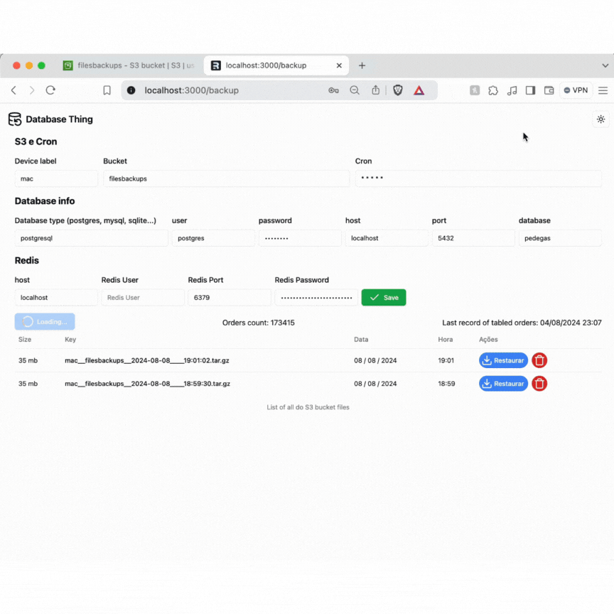

# 🎲 👹 Database Thing

##### Backup/restore your database with an interative UI
##### List all backups files in AWS S3
##### Create a CRON to schedule automatic backups 
##### Clear all redis keys after database update

- [ ] Cron
- [ ] Notificações via whatsapp
- [x] Listando backups
- [x] Botão para realizar backup e fazer upload
- [x] Colocar nome do backup de acordo com o dispositivo
- [x] Remover backup pela ui
- [x] Remover backup local