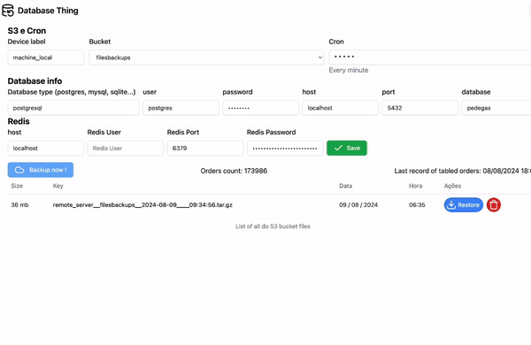

# 🎲 👹 The Database Thing



###### What does the database thing do ?
- Backup/restore your database with an interative UI
- List all backups files in AWS S3
- Create a CRON to schedule automatic backups 
- Clear all redis keys after database update

## How to run

#### Run app
> Create .env file, run prisma migrations, and finally run the app
```bash
cp .env.example .env # Create .env and modify the AWS credentials.
npm install # install deps
npx prisma migrate dev # Create migrations in database
npm run dev # Run app
```

> The way I'm running in my env is using PM2

#### Todo List

- [ ] Create `Dockerfile/docker-compose` ?
- [x] Whatsapp Notifications `(using CURL)`
<!-- - [ ] Email notifications -->
- [x] Cron
- [x] List S3 backups
- [x] Button to backup
- [x] Restore selecting backup file
- [x] Button to remove S3 backup via ui
- [x] Add device alias to file name
- [x] Delete local Files